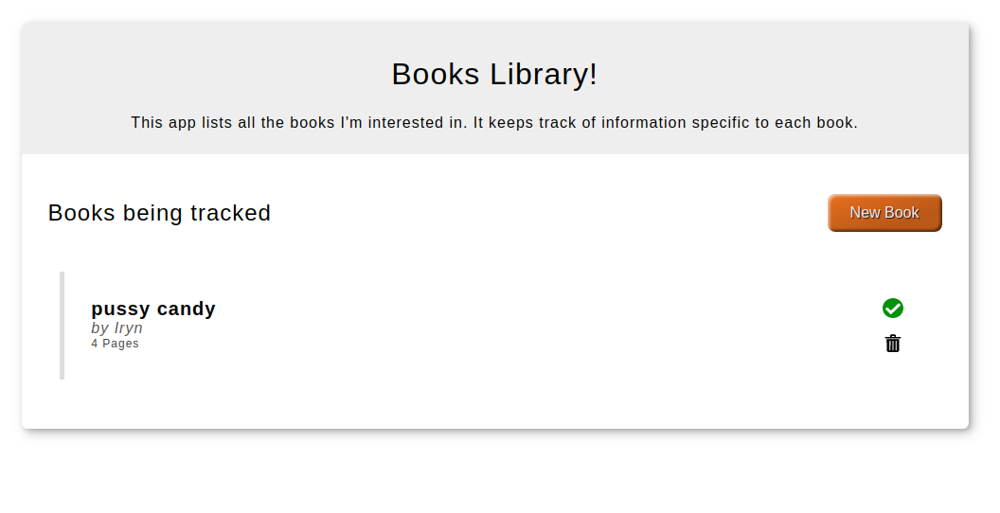

## Library
The book library assigment allows user to create and delete books.

The book library assigment allows user to create books with the pages and mark them as read or unread, the assignment also allows user to delete the books.

## Built With

- Javascript,
- css,

## Live Demo

[Live Demo Link](https://mbabaliiryn.github.io/Library/)

## Getting Started
- clone the repo
- run `npm install`
- open the index page from the browser for usage.

To get a local copy up and running follow these simple example steps.

### Prerequisites

### Setup

### Install

### Usage 
- click on add book and fill the required fields and mark it as read or unread.
- after click on add book to create a book
- click on the delete icon to delete a book
- click on the read and unread button to change the status.

## Authors

👤 **Keshav Chakravarthy**

    - [LinkedIn](https://www.linkedin.com/in/k3shavchakravarthy/)
    - Github: [@keshav-c](https://github.com/keshav-c)

👤 **Mbabali Iryn**

- Github: [@mbabaliiryn](https://github.com/mbabaliiryn)
- Twitter: [@irynmbabali](https://twitter.com/irynmbabali)
- Linkedln: [mbabaliiryn](https://www.linkedin.com/in/mbabaliiryn)

## 🤝 Contributing

Contributions, issues and feature requests are welcome!

Feel free to check the [issues page](https://github.com/mbabaliiryn/Library/issues/).

## Show your support

Give a ⭐️ if you like this project!

## Acknowledgments

- The odin project
- friconix for the icons

## 📝 License

This project is [MIT](lic.url) licensed.